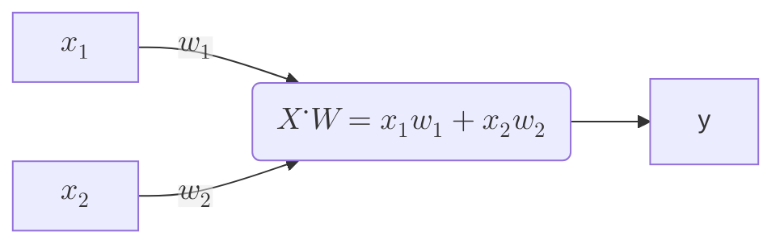
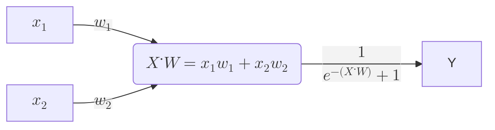
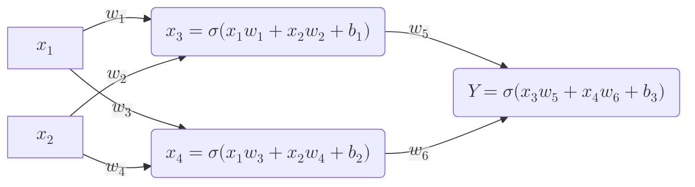

### ML

Write the code directly(one aspect)

Write a model that can predict or optimise something, and has parametete
- code hoe you epxect it to behavv
- give the data, to fit the discription $\to$ generate values
- Automatic modelling 
 
Example:
- Industrial process to convert to usable things $\to$ process was expensive, waste resoucrs yield(parameteres)
- Researchesrs what are optimal paramerters? Expensive by experimentation, making fewer experiment, create mathematical model 
- fit the line to predict the data 
- automate this process
- conduct ecperiments, tweak modeles which one fits it, and predict 

### Regression in ML, closed form solution 

$$cost(w) = MSE = \frac {1}{n} \sum_{i=1}^n (y_i - x_iw)^2$$

$$\frac{\partial cost(w)}{\partial w} = \frac{-2}{n} \sum_{i=1}^n x_i(y_i - x_iw)$$ (chain rule)

$$\frac{\partial cost(w)}{\partial w} = 0$$

$$\frac{-2}{n} \sum_{i=1}^n x_i(y_i - x_iw) = 0 \to \sum_{i=1}^n x_iy_i - \sum_{i=1}^nx_i^2w = 0$$

$$w = \sum_{i=1}^n \frac{x_iy_i}{x_i^2}$$ (computationally inefficient)

### Gradient Descent Algorithm
$C(w)$ is the cost function, $C'(w)$ is the differential of the cost fucntion

$w \to w + \eta \frac{2}{n} \sum_{i=1}^n x_i(x_iw - y_i)$ where $\eta$ is the learning rate

In short: $ w \to w + \eta C'(w)$

Cost fucntion can become more complex, and the initial param should be randomised

Consider the case where we have for the neuron:
$Wx + b$ where b is a bias. 

$C(w) = MSE = 1/n \sum_{i=1}^n (x_iw + b - y_i)^2$

Then we simply have $\frac{\partial C}{\partial w} = \frac{2}{n} \sum_{i=1}^n x_i(x_iw + b - y_i)$

$\frac{\partial C}{\partial b} = \frac{2}{n} \sum_{i=1}^n (x_iw + b - y_i)$

Then we have 2 gradient descents taking place, 
- $w \to w + \eta C'(w)$ 
- $b \to b + \eta C'(b)$

In next example we will shall see a perceptron that uses two inputs and weights

***
Some maths with 2 weights and a bias

$C(w_1, w_2, b) = \frac{1}{n}\sum_{i=1}^n (x_{1,i}w_1 + x_{2,i}w_2 + b- y_i)^2$

$\frac{\partial C}{\partial w_1} = \frac{2}{n} \sum_{i=1}^n (x_{1,i}w_1 + x_{2,i}w_2 - y_i)x_{1,i}$

$\frac{\partial C}{\partial w_2} = \frac{2}{n} \sum_{i=1}^n (x_{1,i}w_1 + x_{2,i}w_2 - y_i)x_{2,i}$

$\frac{\partial C}{\partial b} = \frac{2}{n} \sum_{i=1}^n (x_{1,i}w_1 + x_{2,i}w_2 - y_i)$

***
Generally:

$$C(\bold w) = \frac{1}{n}\sum_{i=1}^n (\sum_{j=1}^m(x_{j,i}w_j) + b - y_i)^2$$

$$\frac{\partial C}{\partial w_k} = \frac{2}{n} \sum_{i=1}^n (\sum_{j=1}^m(x_{j,i}w_j) + b - y_i)x_{k,i}$$

$$\frac{\partial C}{\partial b} = \frac{2}{n} \sum_{i=1}^n (\sum_{j=1}^m(x_{j,i}w_j) + b - y_i)$$

Then we these gradient descents taking place, 
- $w_k \to w_k + \eta \frac{\partial C}{\partial w_k}$ 
- $b \to b + \eta \frac{\partial C}{\partial b}$

We can use this to model OR and AND gate, or even multi more multi input single output neuron

We also have activation fucntions, that isolate output values to specific groups
One such fucntions is the sigmoid, maps from -inf to inf, to 0 to 1.
$$\sigma(x) = \frac{1}{e^{-x} + 1}$$

Another function is ReLU: important for multilayer, and in back-propagation:
$$ReLU \to f(x) = max(0,x)$$

To model XOR, we require a multilayer network because of linear sepreability. XOR requires other functions to represent it(a ^ b = (a|b)&(~(a&b)))

##

### Multi layer neuron(with 2 neurons)

#### Forward Pass

In this network to update the 9 parameters($w_1,w_2,w_3,w_4,w_5,w_6,b_1,b_2,b_3$), we need to perform 9 gradient descents

Let us understand this network from matrices point of view:

$$\bold X = \begin{pmatrix} x_1 \\ x_2 \end{pmatrix}$$

$$\bold W_1 = \begin{pmatrix} w_1 & w_2 \\ w_3 & w_4\end{pmatrix}$$

Essentially we perform this for the first layer:

$$\bold W_1 \cdot \bold X = \begin{pmatrix} w_1 & w_2 \\ w_3 & w_4  \end{pmatrix} \cdot \begin{pmatrix} x_1 \\ x_2 \end{pmatrix}$$

$$\bold W_1 \cdot \bold X = \begin{pmatrix} x_1w_1 + x_2w_2 \\ x_1w_ 3+x_2w_4 \end{pmatrix} $$

$$\bold W_1 \cdot \bold X = \begin{pmatrix} x_1w_1 + x_2w_2 \\ x_1w_ 3+x_2w_4 \end{pmatrix} $$

We then add the bias:
$$\bold W_1 \cdot \bold X + \bold b= \begin{pmatrix} x_1w_1 + x_2w_2 \\ x_1w_3+x_2w_4 \end{pmatrix}  + \begin{pmatrix} b_1 \\ b_2 \end{pmatrix} = \begin{pmatrix} x_1w_1 + x_2w_2 + b_1 \\ x_1w_3+x_2w_4+b_2 \end{pmatrix}$$

Apply activation:
$$\bold X_{a1} = \sigma(\bold W_1 \cdot \bold X + \bold b)$$

In the next layer or the final result in the forward pass, we multiply with the final vector
$$\bold Y = \sigma(\sigma(\bold W_1 \cdot \bold X + \bold b)\cdot \bold W_2+b_3)$$

Generally:
$$
\mathbf{a_l} = \sigma(\mathbf{W_l a_{l-1}} + \mathbf{b_l}), \qquad l = 1, \dots, L-1
$$

Output layer:

$$
\mathbf{Y} = \mathbf{W_L a_{L-1}} + \mathbf{b_L}
$$

3-layer expanded example:

$$
\mathbf{Y} =
\sigma \!\left(
\mathbf{W_3}
\, \sigma \!\left(
\mathbf{W_2}
\, \sigma \!\left(
\mathbf{W_1 X} + \mathbf{b_1}
\right)
+ \mathbf{b_2}
\right)
+ \mathbf{b_3}
\right)$$

Which essentially translates to multiplication of 2 by 1 with 2 by 1, resulting a singular value.
We also note that for each of the parameter matrices, we run gradient descent to drive each of them to optimal values. 

> NOTE: In the model there will be non-linear activation fucntions between each layer's pass, this is key to introduce learning behavior and so that linear system does not collapse to a linear function

#### Backpropagation and Gradient Descent
Say now we wish to optimise this model, by running gradient descent on W and b to have a network that can learn more complex behavior, like non-linear behavior. This is exactly like before, but now we need to introduce $\bold{backpropagation}$. Which put simply is finding the error at last layer, and by using chain rule propagating it backwards optimising all network parameters.

In short we want to do SGD on the weight and bias matrices like always, $W_L$ and $b_L$. And by using descent find the optimal values for the hypersurfaces.

#### Backpropagation 
Define cost function: 
$$C = \frac{1}{2} \cdot (\hat{y} - y)^2$$

Our recursive structure for normal forward pass is:
$$z_l = W_l \cdot a_{l-1} + b_l$$

i.e. this layer is activation and forward of previous layers

$$a_l = \sigma(z_l)$$
Where sigma is non linear activation

Also note that for the last layer:
$$a_l =  \hat{y}$$

> Goal: We wish to find $$\frac{\partial C}{\partial W_l}, \frac{\partial C}{\partial b_l}$$

#### First puzzle piece 
$$\frac{\partial C}{\partial W_l} = \frac{\partial C}{\partial z_l} \cdot \frac{\partial z_l}{W_l}$$ 
because ultimately we are minimising $C(W_L)$ the linking variable is $z_L$ i.e output of this layer

#### Second puzzle piece:

$$\frac{\partial C}{\partial z_l} = \frac{\partial C}{\partial a_l} \cdot \frac{\partial a_l}{\partial z_l}$$
But $$a_l = \hat{y}$$, thus: 
$$C = \frac{1}{2} \cdot (\hat{y} - y)^2 = \frac{1}{2} \cdot (a_l - y)^2$$ 

For final layer:
$$\frac{\partial C}{\partial a_L} = a_L - y = \sigma(z_L) - y$$ 

This represents the difference between the network output for l layer and the actual output.

$$\frac{\partial C}{\partial z_L} = (\sigma(z_L) - y) \cdot \frac{\partial a_L}{\partial z_L}$$ 
$$\frac{\partial a_L}{\partial z_L} = 1 \cdot \sigma'(z_L)$$
$$\frac{\partial C}{\partial z_L} = (\sigma(z_L) - y) \cdot \sigma'(z_L)$$

If we use sigmoid, then: 
$$\sigma(x) = \frac{1}{e^{-x} + 1}$$
$$\sigma'(x) = \frac{0-(-e^{-x})}{(e^{-x} + 1)^2} =\frac{e^{-x}}{(e^{-x} + 1)}\cdot \frac{1}{(e^{-x} + 1)} = \sigma(x)(1 - \sigma(x))$$

Thus:
$$\sigma'(z_L) = \sigma(z_L)(1 - \sigma(z_L))$$ 

We can call this:
$$\delta(z_L) = (\sigma(z_L) - y) \circ \sigma(z_L)(1-\sigma(z_L))$$

Because:
$$z_l = W_L \cdot a_{L-1} + b_L$$
$$\frac{\partial z_L}{\partial W_L} = a_{L-1}$$
Putting all the pieces together:

$$\frac{\partial C}{\partial W_L} = \frac{\partial C}{\partial z_L} \cdot \frac{\partial z_L}{W_L}$$

$$\frac{\partial C}{\partial z_L} = (\sigma(z_L) - y) \cdot \sigma'(z_L)$$

$$\frac{\partial z_L}{\partial W_L} = a_{L-1}$$

$$\frac{\partial C}{\partial W_L} = (\sigma(z_L) - y) \cdot \sigma'(z_L)\cdot{a_{L-1}}
$$

For the sigmoid activation:
$$\frac{\partial C}{\partial W_L} = a_{L-1} \cdot (\sigma(z_L) - y) \cdot (\sigma(z_L)(1 - \sigma(z_L)))$$ 
Which using delta is:

$$\frac{\partial C}{\partial W_L} = {a_{L-1}} \cdot \delta(z_L)^T$$ 

For the bias we simply have
$$\frac{\partial C}{\partial b_L} = \frac{\partial C}{\partial z_L} \cdot \frac{\partial z_L}{\partial b_L} $$

$$z_l = W_L \cdot a_{L-1} + b_L$$
$$\frac{\partial z_L}{\partial b_L} = 1$$

$$\frac{\partial C}{\partial b_L} = \delta(z_L) \cdot 1 = \delta(z_L)$$

So the descent update is:
$$W \gets W - \eta \cdot \frac{\partial C}{\partial W} = W_L - \eta \cdot a_{L-1} \cdot \delta(z_L)$$
$$b \gets b - \eta \cdot \frac{\partial C}{\partial b} = b_L - \eta \cdot \delta(z_L)$$

Hidden Layer, finding :
$$\frac{\partial C}{\partial z_l} = \delta(z_l)$$
$$z_l = W_l \cdot a_{l-1} + b_l$$
$$a_l = \sigma(z_l)$$
$$z_{l+1} = W_{l+1} \cdot a_{l} + b_{l+1}$$
$$a_{l+1} = \sigma(z_{l+1})$$

It is clear that:
$$\frac{\partial C}{\partial z_l} = \frac{\partial C}{\partial z_{l+1}} \cdot \frac{\partial z_{l+1}}{\partial z_l}$$ 

##
>Then:
>$$\frac{\partial z_{l+1}}{\partial z_l} = \frac{\partial}{\partial z_L}(W_{l+1} \cdot a_{l} + b_{l+1}) $$
Link with $a_l$:

$$\frac{\partial C}{\partial z_l} = \frac{\partial C}{\partial z_{l+1}} \cdot \frac{\partial z_{l+1}}{\partial a_l} \cdot \frac{\partial a_l}{\partial z_l} $$ 

$$\frac{\partial C}{\partial z_{l+1}} = \delta(z_{l+1})$$
$$\frac{\partial z_{l+1}}{\partial a_l} = W_{l+1}$$
$$\frac{\partial a_l}{\partial z_l} = \sigma'(z_l)$$

>$$\frac{\partial C}{\partial a_l} = \frac{\partial C}{\partial z_{l+1}}\cdot\frac{\partial z_{l+1}}{\partial a_l} = W_{l+1}^T \cdot \delta(z_{l+1})$$

$$\delta(z_{l}) =  (W_{l+1}^T \cdot \delta(z_{l+1})) \circ \sigma'(z_l)$$
Where $\circ$ is element wise product, and we take tranpose because we are moving backwards so the product should be r x n ~ n x p not r x n ~ p x n
##
### Vanashing Gradient(problem with sigmoid)
>What is interesting is that when using sigmoid fucnction with 5 or more layers we have an issue of vanashing gradient, where the gradient becomes too small to provide any meaningful learning, which means the overall output is gibberish.

### Vanishing Gradient (problem with sigmoid in deep networks)

When using the sigmoid activation in networks with many layers (≈5+), training can fail because the gradient becomes extremely small as it is propagated backwards through layers.

Backpropagation computes gradients using:

$$\delta(z_{l}) =  (W_{l+1}^T \cdot \delta(z_{l+1})) \odot \sigma'(z_l)$$

For the sigmoid function, lets see maths why activation dies:

If we use sigmoid, then(FIX LATER)
$$\sigma(x) = \frac{1}{e^{-x} + 1}$$
$$\sigma'(x) = \frac{e^{-x}}{(e^{-x} + 1)^2} =\frac{e^{-x}}{(e^{-x} + 1)}\cdot \frac{1}{(e^{-x} + 1)} = \sigma(x)(1 - \sigma(x))$$
$$\sigma''(x) = \frac{-e^{-x}(e^{-x} + 1)^2 + 2(e^{-x} + 1)(e^{-x})(e^{-x})}{(e^{-x} + 1)^4} =\frac{((e^{-x} + 1))[-e^{-x}(e^{-x} + 1)^1 + 2e^{-2x}]}{(e^{-x} + 1)^4} $$
$$\sigma''(x) = \frac{-e^{-x}(e^{-x} + 1)^1 + 2e^{-2x}}{(e^{-x} + 1)^3}$$

Find maximum update
$$\sigma''(x) = 0 $$
$$-e^{-x}(e^{-x} + 1) + 2e^{-2x} = 0, e^{-x} \not= 0$$
$$e^{-2x} -e^{-x}+ 2e^{-2x} = 0$$
$$3e^{-2x} - 4e^{-x}= 0$$

#### Why this happens

Sigmoid saturates for large positive/negative inputs, where its slope is near zero. Deep networks push activations into these saturated regions, killing gradients during backpropagation.

---

#### Historical significance

This problem prevented deep neural networks from training successfully before ~2012.

---

#### The fix (ReLU breakthrough)

Using ReLU activation:

$$
ReLU(x) = \max(0, x)
$$

$$
ReLU'(x) =
\begin{cases}
1 & x > 0 \\
0 & x \le 0
\end{cases}
$$

Gradients no longer shrink across layers.

This is why modern deep networks use ReLU (or variants) for hidden layers and sigmoid/softmax only at the output layer.

---

### General Neural Network 

So far we discussed MSE as a loss function and sigmoid or relu for activation, with arbritary layers and nodes. Now let us write rules for most generic NN, so the abstraction, and the implementation of more complex models is clear. 

Let use be more generic and define the following:
Let the cost or loss function be $C(x)$, and define activation as $\sigma(x)$ (Not the sigmoid but general).

Forward pass is a standard, starting from first layer, multiply by first, add bias, activate, and continue. 

#### Backpropagation 
Define cost function: 
$$C(y, \hat y)$$

Our recursive structure for normal forward pass is:
$$z_l = W_l \cdot a_{l-1} + b_l$$

i.e. this layer is activation and forward of previous layers

$$a_l = \sigma(z_l)$$
Hidden Layer, finding :
$$\frac{\partial C}{\partial z_l} = \delta(z_l)$$
$$z_l = W_l \cdot a_{l-1} + b_l$$
$$a_l = \sigma(z_l)$$
$$z_{l+1} = W_{l+1} \cdot a_{l} + b_{l+1}$$
$$a_{l+1} = \sigma(z_{l+1})$$

It is clear that:
$$\frac{\partial C}{\partial z_l} = \frac{\partial C}{\partial z_{l+1}} \cdot \frac{\partial z_{l+1}}{\partial z_l}$$ 

>Then:
>$$\frac{\partial z_{l+1}}{\partial z_l} = \frac{\partial}{\partial z_L}(W_{l+1} \cdot a_{l} + b_{l+1}) $$
>
Link with $a_l$:

$$\frac{\partial C}{\partial z_l} = \frac{\partial C}{\partial z_{l+1}} \cdot \frac{\partial z_{l+1}}{\partial a_l} \cdot \frac{\partial a_l}{\partial z_l} $$ 

$$\frac{\partial C}{\partial z_{l+1}} = \delta(z_{l+1})$$
$$\frac{\partial z_{l+1}}{\partial a_l} = W_{l+1}$$
$$\frac{\partial a_l}{\partial z_l} = \sigma'(z_l)$$

>$$\frac{\partial C}{\partial a_l} = \frac{\partial C}{\partial z_{l+1}}\cdot\frac{\partial z_{l+1}}{\partial a_l} = W_{l+1}^T \cdot \delta(z_{l+1})$$

$$\delta(z_{l}) =  (W_{l+1}^T \cdot \delta(z_{l+1})) \circ \sigma'(z_l)$$
Where $\circ$ is element wise product, and we take tranpose because we are moving backwards so the product should be r x n ~ n x p not r x n ~ p x n
